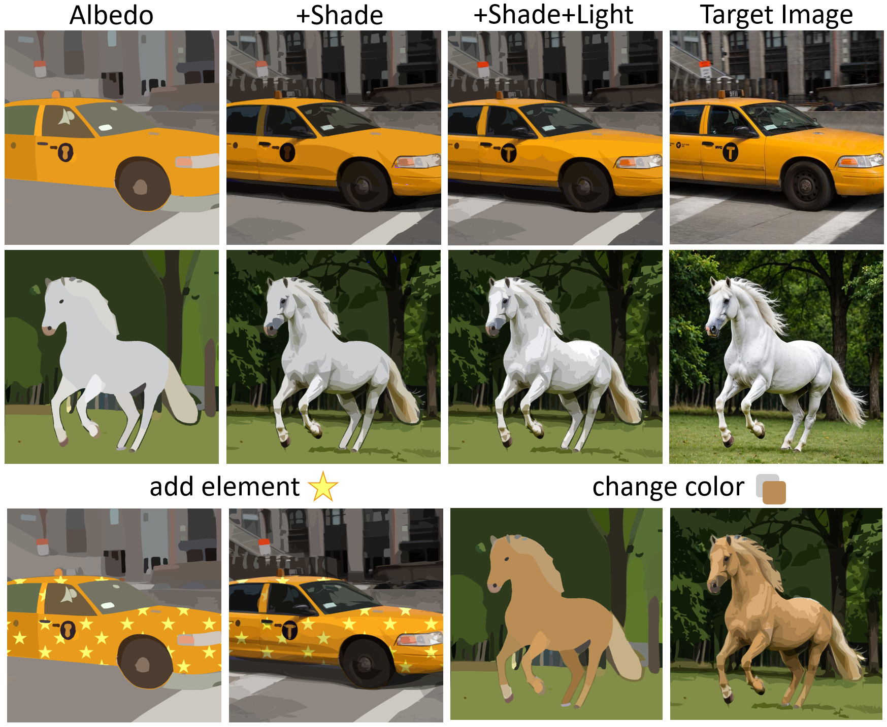
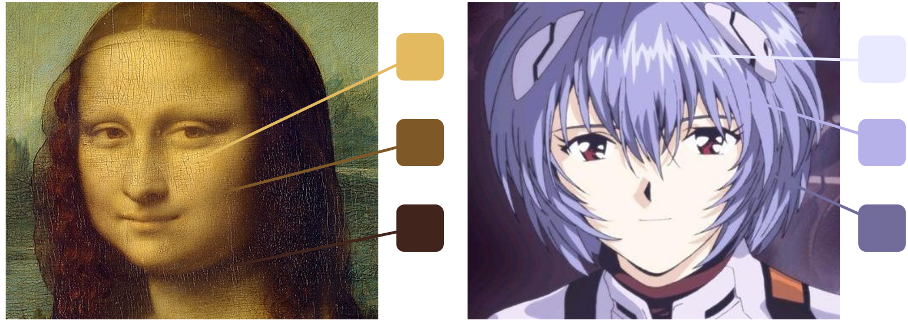

# Clair Obscur: an Illumination-Aware Method for Real-World Image Vectorization (CVPR 2026 Highlight)

[arXiv](https://arxiv.org/abs/2511.20034)
[License](LICENSE)

**Xingyue Lin**, Shuai Peng, Xiangyu Xie, Jianhua Zhu, Yuxuan Zhou, Liangcai Gao  
Wangxuan Institute of Computer Technology, Peking University

---

## Description

Official implementation of **[Clair Obscur: an Illumination-Aware Method for Real-World Image Vectorization](https://arxiv.org/abs/2511.20034)**.

**COVec** is an illumination-aware vectorization framework inspired by the *Clair-Obscur* principle of light-shade contrast.  
It introduces intrinsic decomposition in the vector domain, representing each image with **albedo**, **shade**, and **light** layers in one editable SVG.

<p align="center">
  
</p>
<p align="center"><em>Progressive composition from albedo, shade, and light; editing by modifying albedo while preserving illumination.</em></p>

<p align="center">
  
</p>
<p align="center"><em>The principle of Clair-Obscur in art. Classical painting and modern animation use tone variations within the same semantic regions (e.g. skin, hair) to convey light–shade structure.</em></p>


## Code

### Requirements

- Python 3.10+ with CUDA 12.x GPU
- [pydiffvg](https://github.com/BachiLi/diffvg) (built from source)
- [SAM ViT-H](https://github.com/facebookresearch/segment-anything) checkpoint
- [Intrinsic](https://github.com/compphoto/Intrinsic) (optional, for `--generate_albedo`)
- Stable Diffusion v1.5 (optional, for SDS simplification)

### Installation

**Quick install**

```bash
conda create -n covec python=3.10 -y
conda activate covec
cd Pipeline
chmod +x setup_single_env.sh
./setup_single_env.sh
```

**Manual install** (order matters, pin `torch 2.4+cu124`)

```bash
pip install torch==2.4.0 torchvision==0.19.0 \
  --index-url https://download.pytorch.org/whl/cu124
pip install -r requirements-base.txt
bash install_diffvg.sh
pip install -c constraints.txt git+https://github.com/compphoto/Intrinsic.git
```

Download [SAM ViT-H](https://dl.fbaipublicfiles.com/segment_anything/sam_vit_h_4b8939.pth) to `Pipeline/checkpoints/`  
(see `Pipeline/checkpoints/README.md`), or set:

```bash
export SAM_CHECKPOINT="/path/to/sam_vit_h_4b8939.pth"
```

### Usage

Run from `Pipeline/`:

```bash
# Full pipeline with automatic albedo generation
python pipeline.py \
  --run_all --generate_albedo --image_name 2-thing-2.png --path_num 64

# Full pipeline (albedo already prepared)
python pipeline.py \
  --run_all --image_name 2-thing-2.png --path_num 64
```

Place inputs under `target_imgs/init/` and albedo references under `target_imgs/albedo/`.  
Output: `workdir/<image_name>/<path_num>_paths/result.svg`

**Generate albedo only**

```bash
python utils/albedo_generator.py \
  --input ./target_imgs/init/2-thing-2.png \
  --output ./target_imgs/albedo/2-thing-2.png
```

More qualitative results: [examples](https://github.com/decade-de/COVec/tree/main/examples)

**Notes & troubleshooting**


| Topic      | Detail                                                                    |
| ---------- | ------------------------------------------------------------------------- |
| PyTorch    | Pin `2.4+cu124`; install Intrinsic with `constraints.txt`                 |
| pydiffvg   | Build with `bash install_diffvg.sh` only                                  |
| GPU memory | `release_intrinsic_after_albedo: true` frees VRAM before SAM              |
| Intrinsic  | Academic use only - see [license](https://github.com/compphoto/Intrinsic) |


If pydiffvg build fails (CUDA / GLIBCXX mismatch), set `CUDA_HOME=/usr/local/cuda-12.4` and rerun `bash install_diffvg.sh`.


## License

This project is released under the [Apache 2.0 License](LICENSE).

Third-party:
[pydiffvg](https://github.com/BachiLi/diffvg) (Apache 2.0),
[SAM](https://github.com/facebookresearch/segment-anything) (Apache 2.0),
[Stable Diffusion v1.5](https://huggingface.co/runwayml/stable-diffusion-v1-5) (CreativeML Open RAIL-M),
[Intrinsic](https://github.com/compphoto/Intrinsic) (academic only).